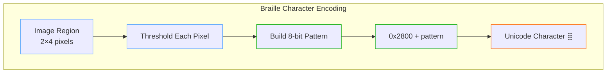
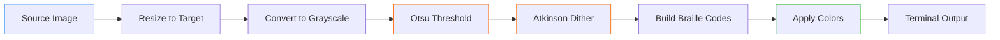
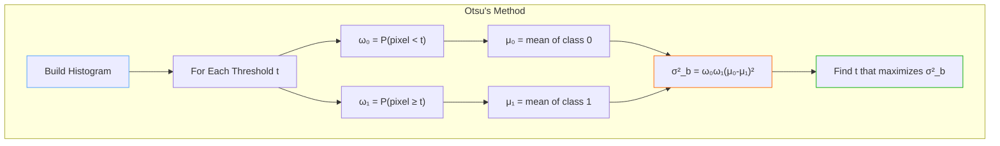
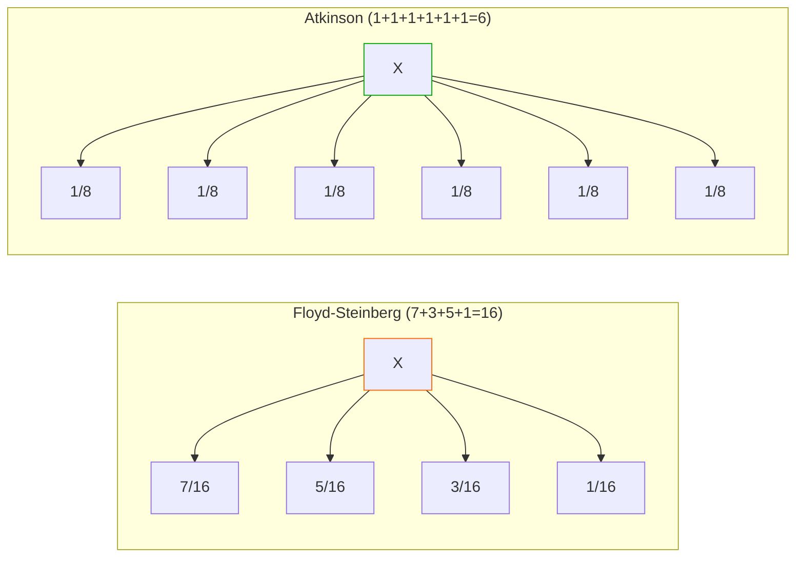
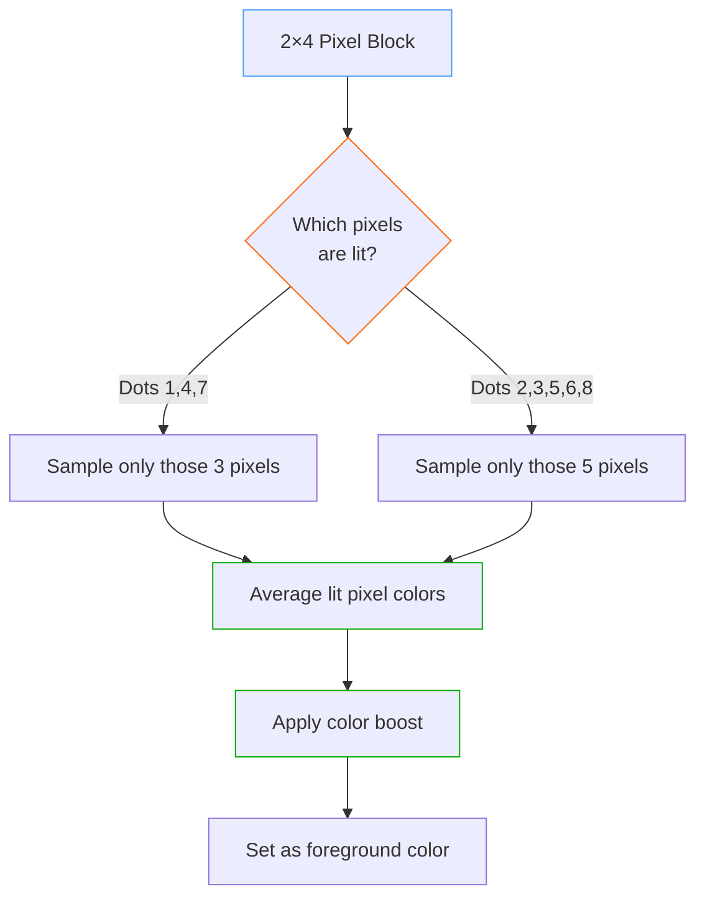
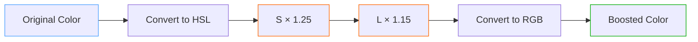
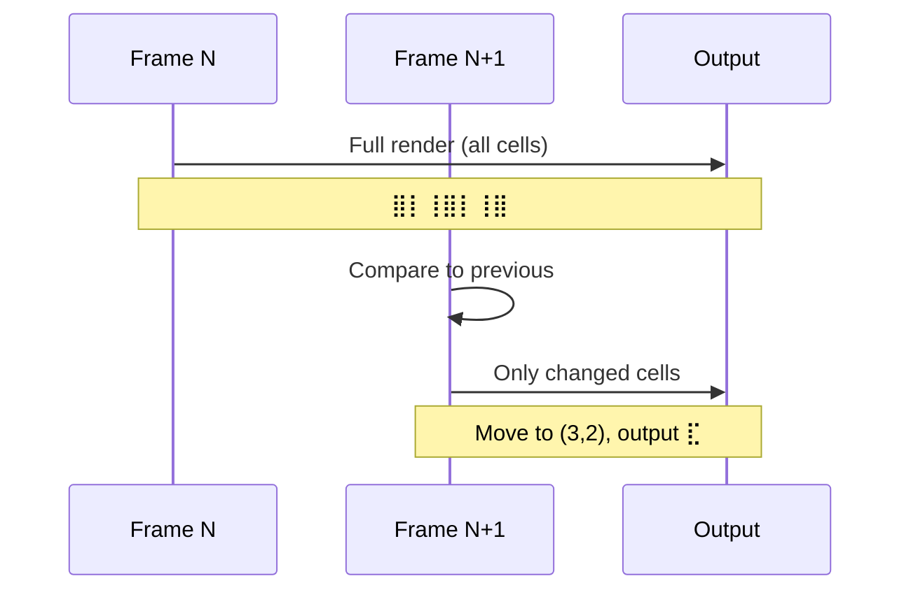

# Braille Rendering: 8x Resolution ASCII Art

**How ConsoleImage achieves ultra-high-resolution terminal graphics using Unicode braille characters**

## Introduction

Traditional ASCII art is limited by a fundamental constraint: each character cell can only display one symbol. Whether you use `@`, `#`, or `.`, you get exactly one "pixel" per character position. But what if we could pack **eight pixels** into every character cell?

That's exactly what braille rendering does. By using Unicode braille characters (U+2800–U+28FF), we can represent a 2×4 grid of dots within each character cell, effectively multiplying our resolution by 8x compared to traditional ASCII art.

```
Traditional ASCII (1 pixel/cell):     Braille (8 pixels/cell):

  @@@@@@                              ⣿⣿⣿⣿⣿⣿
  @    @                              ⡇    ⢸
  @    @          vs                  ⡇    ⢸
  @@@@@@                              ⣿⣿⣿⣿⣿⣿
```

## The Unicode Braille Block

### Character Structure

Unicode braille characters encode an 8-dot pattern in a 2×4 grid:

```
┌─────┬─────┐
│  1  │  4  │  ← Row 0
├─────┼─────┤
│  2  │  5  │  ← Row 1
├─────┼─────┤
│  3  │  6  │  ← Row 2
├─────┼─────┤
│  7  │  8  │  ← Row 3
└─────┴─────┘
  Col0  Col1
```

Each dot corresponds to a specific bit in the character code:

| Dot Position | Bit Value |
|--------------|-----------|
| Dot 1 (top-left) | 0x01 |
| Dot 2 | 0x02 |
| Dot 3 | 0x04 |
| Dot 4 (top-right) | 0x08 |
| Dot 5 | 0x10 |
| Dot 6 | 0x20 |
| Dot 7 (bottom-left) | 0x40 |
| Dot 8 (bottom-right) | 0x80 |

The character code is simply: `0x2800 + (bit pattern)`



### Why This Encoding?

The braille encoding follows the historical Braille system, where dots 1-6 form the original 6-dot Braille (used for letters), and dots 7-8 were added later for computer Braille. This explains the seemingly odd bit ordering—it preserves compatibility with traditional Braille text.

## The Rendering Pipeline



### Step 1: Intelligent Resizing

For a terminal width of W characters and height of H characters, we need:
- **Pixel width**: W × 2 (2 dots per character horizontally)
- **Pixel height**: H × 4 (4 dots per character vertically)

The aspect ratio compensation accounts for terminal fonts being taller than wide (typically 2:1).

### Step 2: Optimal Thresholding with Otsu's Method

The key challenge in braille rendering is deciding which dots to turn on. A naive approach might use a fixed threshold (e.g., 50% brightness), but this fails badly for images that are predominantly light or dark.

**Otsu's method** finds the optimal threshold by maximizing the variance between foreground and background classes:



The algorithm:

1. **Build a histogram** of pixel intensities (256 bins)
2. **For each possible threshold** (0-255):
   - Calculate the probability of each class (background/foreground)
   - Calculate the mean intensity of each class
   - Compute the between-class variance
3. **Select the threshold** that maximizes between-class variance

This automatically adapts to any image—dark images get low thresholds, bright images get high thresholds, and high-contrast images get thresholds right in the middle.

```csharp
private static byte ComputeOtsuThreshold(ReadOnlySpan<byte> grayPixels)
{
    // Build histogram
    Span<int> histogram = stackalloc int[256];
    foreach (var pixel in grayPixels)
        histogram[pixel]++;

    int total = grayPixels.Length;
    float sumTotal = 0;
    for (int i = 0; i < 256; i++)
        sumTotal += i * histogram[i];

    float sumBackground = 0;
    int weightBackground = 0;
    float maxVariance = 0;
    byte optimalThreshold = 0;

    for (int t = 0; t < 256; t++)
    {
        weightBackground += histogram[t];
        if (weightBackground == 0) continue;

        int weightForeground = total - weightBackground;
        if (weightForeground == 0) break;

        sumBackground += t * histogram[t];
        float meanBackground = sumBackground / weightBackground;
        float meanForeground = (sumTotal - sumBackground) / weightForeground;

        float variance = (float)weightBackground * weightForeground
                       * (meanBackground - meanForeground)
                       * (meanBackground - meanForeground);

        if (variance > maxVariance)
        {
            maxVariance = variance;
            optimalThreshold = (byte)t;
        }
    }

    return optimalThreshold;
}
```

### Step 3: Atkinson Dithering

After thresholding, we have a binary image, but hard edges create ugly banding. **Dithering** diffuses quantization error to neighboring pixels, creating the illusion of intermediate tones.

We use **Atkinson dithering** (developed by Bill Atkinson for the original Macintosh) instead of the more common Floyd-Steinberg algorithm. Here's why:



**Why Atkinson is better for braille:**

| Aspect | Floyd-Steinberg | Atkinson |
|--------|-----------------|----------|
| Error diffused | 100% (16/16) | 75% (6/8) |
| Spread pattern | 4 pixels | 6 pixels |
| Result | Softer gradients | Higher contrast |
| Best for | Photos | Line art, text |

Atkinson deliberately discards 25% of the error, which:
- Produces **sharper edges** (critical for small dot patterns)
- Creates **more distinct light/dark regions**
- Avoids the "muddy" look that Floyd-Steinberg can produce

The Atkinson diffusion pattern:

```
        X   1   1
    1   1   1
        1

(each "1" receives 1/8 of the error)
```

```csharp
private static void ApplyAtkinsonDithering(Span<short> buffer, int width, int height, byte threshold)
{
    for (int y = 0; y < height; y++)
    {
        for (int x = 0; x < width; x++)
        {
            int idx = y * width + x;
            short oldPixel = buffer[idx];
            byte newPixel = oldPixel > threshold ? (byte)255 : (byte)0;
            buffer[idx] = newPixel;

            short error = (short)(oldPixel - newPixel);
            short diffuse = (short)(error / 8);  // 1/8 of error

            // Diffuse to 6 neighbors (only 6/8 = 75% of error)
            if (x + 1 < width)
                buffer[idx + 1] += diffuse;
            if (x + 2 < width)
                buffer[idx + 2] += diffuse;
            if (y + 1 < height)
            {
                if (x > 0)
                    buffer[idx + width - 1] += diffuse;
                buffer[idx + width] += diffuse;
                if (x + 1 < width)
                    buffer[idx + width + 1] += diffuse;
            }
            if (y + 2 < height)
                buffer[idx + width * 2] += diffuse;
        }
    }
}
```

## Color Handling: The Hybrid Approach

Plain braille (white dots on black) works, but color adds tremendous visual impact. However, terminal colors present a challenge: we can only set **one foreground color** per character, but our braille character represents **up to 8 different source pixels**.

### The Naive Approach (and why it fails)

Averaging all 8 pixel colors produces a "solarized" look—colors mix into muddy browns and grays that don't match the source image.

### The Hybrid Solution

We only sample colors from pixels where dots are actually **lit**:



This ensures the displayed color matches what the user actually sees—the lit dots.

```csharp
private static Rgba32 ComputeHybridColor(
    ReadOnlySpan<Rgba32> pixels,
    ReadOnlySpan<byte> gray,
    int brailleCode,
    byte threshold)
{
    int totalR = 0, totalG = 0, totalB = 0;
    int litCount = 0;

    // Only sample colors from pixels that will be displayed as dots
    for (int i = 0; i < 8; i++)
    {
        bool isLit = (brailleCode & (1 << GetBitPosition(i))) != 0;
        if (isLit)
        {
            totalR += pixels[i].R;
            totalG += pixels[i].G;
            totalB += pixels[i].B;
            litCount++;
        }
    }

    if (litCount == 0)
        return new Rgba32(0, 0, 0);

    return new Rgba32(
        (byte)(totalR / litCount),
        (byte)(totalG / litCount),
        (byte)(totalB / litCount));
}
```

### Color Boosting

Braille characters are inherently sparse—a character with only 2-3 dots lit appears dimmer than a solid block. To compensate, we apply **color boosting**:

- **Saturation boost**: +25% (makes colors more vivid)
- **Brightness boost**: +15% (compensates for sparse dots)



The boost amount is configurable:

```csharp
private static Rgba32 BoostColor(Rgba32 color, float saturationBoost, float brightnessBoost)
{
    // Convert to HSL
    float r = color.R / 255f;
    float g = color.G / 255f;
    float b = color.B / 255f;

    float max = Math.Max(r, Math.Max(g, b));
    float min = Math.Min(r, Math.Min(g, b));
    float l = (max + min) / 2;
    float s = 0;
    float h = 0;

    if (max != min)
    {
        float d = max - min;
        s = l > 0.5f ? d / (2 - max - min) : d / (max + min);
        // ... calculate hue
    }

    // Apply boosts
    s = Math.Min(1f, s * saturationBoost);
    l = Math.Min(1f, l * brightnessBoost);

    // Convert back to RGB
    return HslToRgb(h, s, l);
}
```

## Video Optimization: Delta Rendering

For animations and video, redrawing every character every frame is wasteful. Most frames only differ slightly from the previous one. **Delta rendering** tracks changes at the cell level:



The algorithm:

1. **Store previous frame** in a cell buffer (character + color per cell)
2. **For each cell in new frame**:
   - Compare character AND color to previous
   - If identical, skip (no output)
   - If different, output cursor move + new character
3. **Track cursor position** to minimize escape sequences

```csharp
public string RenderFrameDelta(Image<Rgba32> image, string[]? previousFrame)
{
    var currentFrame = RenderToGrid(image);
    var output = new StringBuilder();

    int lastOutputRow = -1;
    int lastOutputCol = -1;

    for (int row = 0; row < height; row++)
    {
        for (int col = 0; col < width; col++)
        {
            string cell = currentFrame[row * width + col];
            string? prevCell = previousFrame?[row * width + col];

            if (cell == prevCell)
                continue;  // Skip unchanged cells

            // Move cursor if needed
            if (row != lastOutputRow || col != lastOutputCol)
            {
                output.Append($"\x1b[{row + 1};{col + 1}H");
            }

            output.Append(cell);
            lastOutputRow = row;
            lastOutputCol = col + 1;
        }
    }

    return output.ToString();
}
```

This optimization typically reduces output by **70-90%** for video content where most of the frame is static.

## Performance Optimizations

### Parallel Processing

For larger images, we process rows in parallel:

```csharp
if (pixelHeight > 64)  // Worth parallelizing
{
    Parallel.For(0, cellHeight, row =>
    {
        ProcessRow(row, buffer, width, threshold, output);
    });
}
else
{
    for (int row = 0; row < cellHeight; row++)
    {
        ProcessRow(row, buffer, width, threshold, output);
    }
}
```

### Stack Allocation

For small buffers (histograms, pixel blocks), we use stack allocation to avoid heap pressure:

```csharp
Span<int> histogram = stackalloc int[256];
Span<Rgba32> cellPixels = stackalloc Rgba32[8];
```

### Lookup Tables

Bit position mapping uses a precomputed lookup table:

```csharp
private static readonly int[] BitPositions = { 0, 1, 2, 6, 3, 4, 5, 7 };

private static int GetBitPosition(int dotIndex)
{
    return BitPositions[dotIndex];
}
```

## Results

The braille renderer produces remarkably detailed output:

| Mode | Resolution per Cell | Best For |
|------|---------------------|----------|
| ASCII | 1×1 | Compatibility, artistic style |
| ColorBlocks | 1×2 | Photos, high color fidelity |
| **Braille** | **2×4** | **Maximum detail, line art, text** |

### Example Comparison

For a 100×50 character output:

| Mode | Effective Pixels |
|------|------------------|
| ASCII | 100 × 50 = 5,000 |
| ColorBlocks | 100 × 100 = 10,000 |
| Braille | 200 × 200 = 40,000 |

Braille provides **8x the resolution** of ASCII and **4x the resolution** of color blocks.

## Conclusion

The braille rendering technique combines several clever algorithms:

1. **Unicode braille encoding** packs 8 dots into each character
2. **Otsu's method** automatically finds the optimal threshold
3. **Atkinson dithering** creates smooth gradients with sharp edges
4. **Hybrid color sampling** matches displayed colors to lit dots
5. **Color boosting** compensates for sparse dot patterns
6. **Delta rendering** optimizes video/animation playback

Together, these techniques produce terminal graphics that rival dedicated image viewers—all using nothing but text characters.

## References

- [Unicode Braille Patterns Block](https://unicode.org/charts/PDF/U2800.pdf)
- [Otsu's Method (Wikipedia)](https://en.wikipedia.org/wiki/Otsu%27s_method)
- [Atkinson Dithering](https://beyondloom.com/blog/dither.html)
- [Original ASCII Rendering Algorithm by Alex Harri](https://alexharri.com/blog/ascii-rendering)
